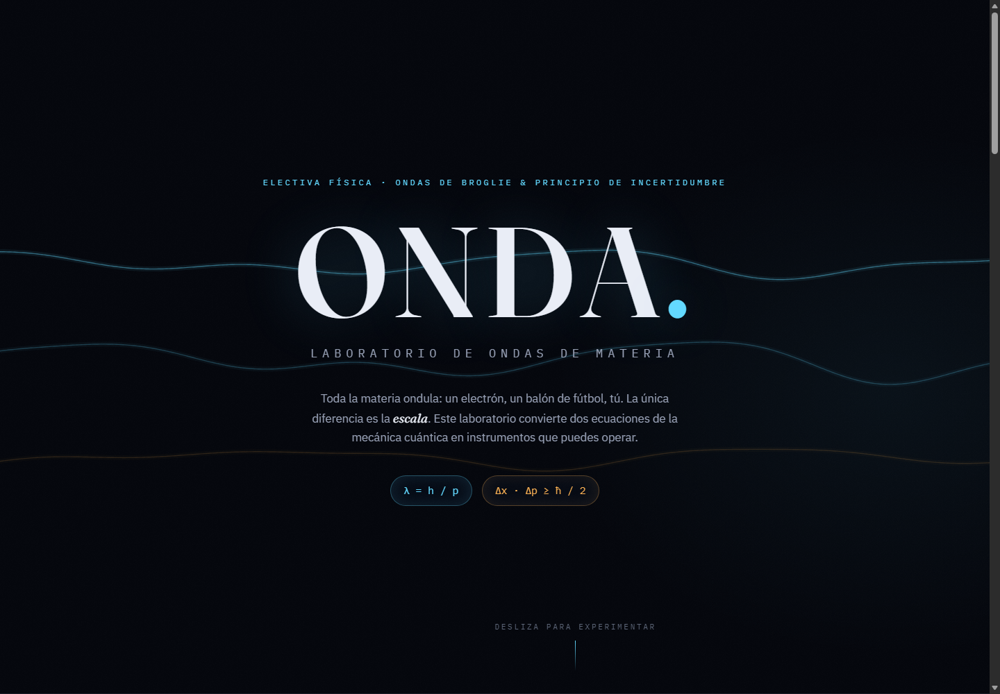
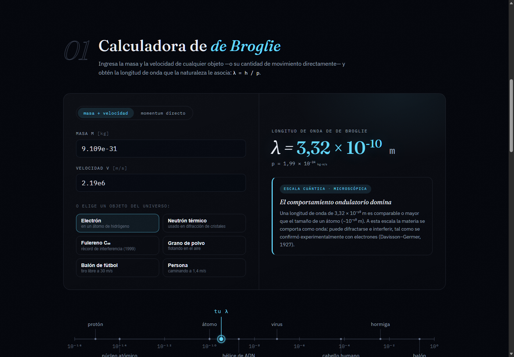
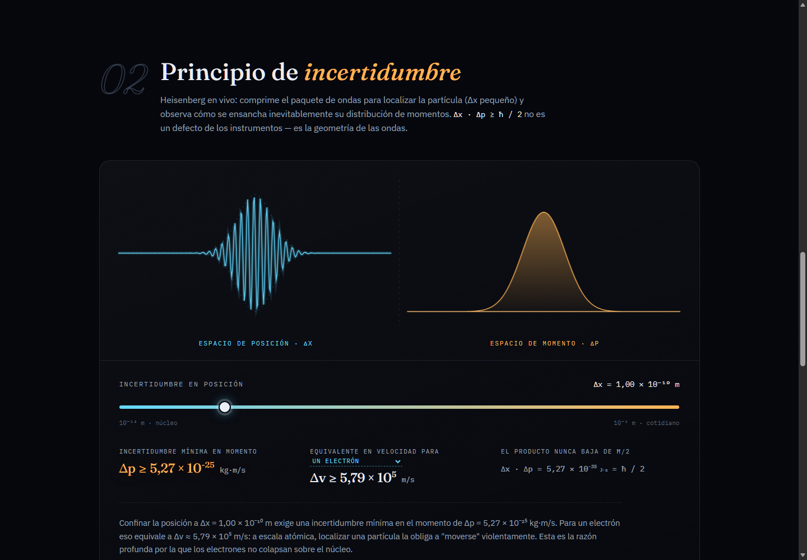
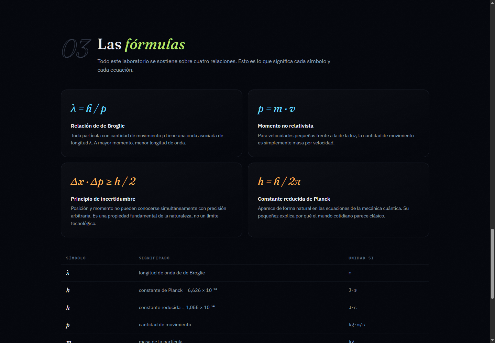
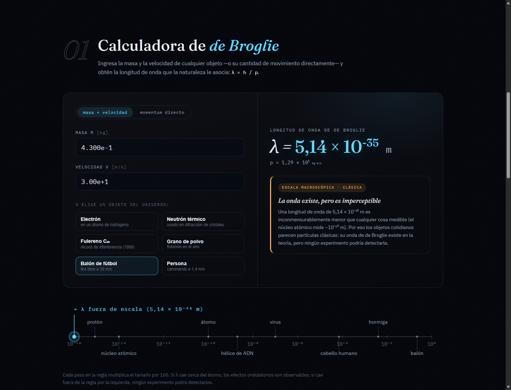

# ONDA. — Laboratorio de Ondas de Materia

Aplicación web interactiva para el trabajo final de **Electiva Física** (Ondas de
Broglie y Principio de incertidumbre) — Escuela Tecnológica Instituto Técnico
Central, Ingeniería de Sistemas.

ONDA convierte dos ecuaciones fundamentales de la mecánica cuántica en
instrumentos interactivos:

- **λ = h / p** — relación de de Broglie
- **Δx · Δp ≥ ħ / 2** — principio de incertidumbre de Heisenberg



---

## Cómo ejecutar la aplicación

Requisitos: [Node.js](https://nodejs.org) 20 o superior.

```bash
npm install      # instalar dependencias (solo la primera vez)
npm run dev      # abrir en modo desarrollo → http://localhost:5173
```

Para generar la versión final optimizada (carpeta `dist/`, lista para publicar
en cualquier hosting estático):

```bash
npm run build
npm run preview  # sirve la versión construida → http://localhost:4173
```

---

## Manual de uso

### 1 · Calculadora de de Broglie



- Ingresa **masa** (kg) y **velocidad** (m/s), o cambia al modo
  **momentum directo** para ingresar `p` (kg·m/s).
- Se acepta notación científica: `9.109e-31` equivale a 9,109 × 10⁻³¹.
- También puedes elegir un **objeto del universo** (electrón, neutrón térmico,
  fulereno C₆₀, grano de polvo, balón de fútbol, persona) y los campos se
  llenan solos.
- La app calcula y muestra en notación científica:
  - la longitud de onda **λ = h / (m·v)**,
  - la cantidad de movimiento **p = m·v**,
  - un **veredicto automático de escala**: cuántica (microscópica),
    mesoscópica o clásica (macroscópica), con una interpretación física
    redactada según el resultado.
- Debajo, la **regla logarítmica del universo** ubica tu λ entre objetos
  conocidos (protón → átomo → virus → cabello → balón). Si λ es demasiado
  pequeña, el marcador lo indica como *fuera de escala* — exactamente la razón
  por la que no vemos ondular los objetos cotidianos.

### 2 · Principio de incertidumbre



- Mueve el **deslizador de Δx** (de 10⁻¹² m, escala nuclear, a 10⁻¹ m, escala
  cotidiana).
- El **paquete de ondas** (izquierda, azul) se comprime o ensancha en vivo, y
  la **distribución de momentos** (derecha, ámbar) hace exactamente lo
  contrario: localizar la partícula ensancha su momento. Eso *es* Heisenberg.
- La app muestra:
  - la incertidumbre mínima **Δp ≥ ħ / (2Δx)**,
  - su equivalente en velocidad **Δv = Δp / m** para una partícula de
    referencia seleccionable (electrón, protón o una persona de 70 kg),
  - el producto **Δx · Δp = ħ/2**, que permanece constante: es el mínimo que
    la naturaleza permite,
  - una interpretación física automática según la escala elegida.

### 3 · Las fórmulas (ayuda conceptual)



Tarjetas con las cuatro relaciones usadas y una tabla de símbolos con sus
unidades SI, para consultar mientras se usa el laboratorio.

---

## Ejemplos de verificación

| Objeto | m (kg) | v (m/s) | λ resultante | Escala |
| --- | --- | --- | --- | --- |
| Electrón (átomo de H) | 9,109 × 10⁻³¹ | 2,19 × 10⁶ | ≈ 3,32 × 10⁻¹⁰ m | cuántica |
| Fulereno C₆₀ | 1,197 × 10⁻²⁴ | 220 | ≈ 2,5 × 10⁻¹² m | mesoscópica |
| Balón de fútbol | 0,43 | 30 | ≈ 5,1 × 10⁻³⁵ m | clásica |

Incertidumbre: con Δx = 10⁻¹⁰ m (tamaño atómico), Δp ≥ 5,27 × 10⁻²⁵ kg·m/s,
que para un electrón equivale a Δv ≈ 5,8 × 10⁵ m/s.



---

## Constantes utilizadas (CODATA / SI)

| Constante | Valor |
| --- | --- |
| h (constante de Planck) | 6,62607015 × 10⁻³⁴ J·s |
| ħ = h/2π (constante reducida) | 1,054571817 × 10⁻³⁴ J·s |

---

## Tecnologías

- **Vite + React 19 + TypeScript** — estructura de la aplicación.
- **Canvas 2D** — animaciones de ondas y del paquete de ondas (sin librerías
  gráficas externas).
- **SVG** — regla logarítmica de escalas.
- Tipografías: Fraunces, IBM Plex Sans e IBM Plex Mono (Google Fonts).

Toda la física vive en un único módulo (`src/physics.ts`): cálculos,
clasificación de escala, interpretaciones y formato de notación científica.

## Estructura del proyecto

```
onda-lab/
├── capturas/            # evidencia: capturas de pantalla
├── src/
│   ├── physics.ts       # constantes, fórmulas e interpretaciones
│   ├── App.tsx
│   ├── index.css        # identidad visual completa
│   └── components/
│       ├── Hero.tsx         # portada con campo de ondas animado
│       ├── BroglieCalc.tsx  # módulo 1: calculadora de de Broglie
│       ├── ScaleRuler.tsx   # regla logarítmica del universo
│       ├── Uncertainty.tsx  # módulo 2: paquete de ondas + Δx·Δp
│       ├── Formulas.tsx     # módulo 3: ayuda conceptual
│       └── SciNumber.tsx    # notación científica
└── index.html
```
